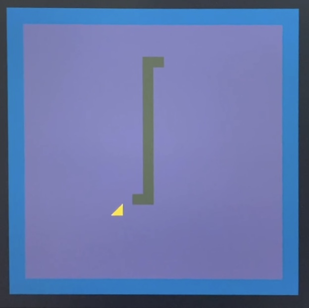
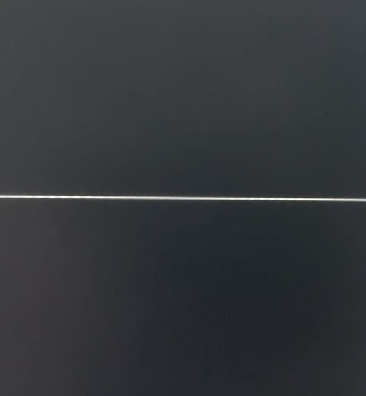

# Snake

This is a simple implementation of the classic Snake game built using Assembly ARMv8.



## Description
In the Snake game the player controls a snake to collect food (cheese triangles in this case).
As the snake eats, it grows longer, and the player must avoid colliding with the walls or the snake's body.

If you crash, the snake flatlines:



The goal is to eat 15 cheese triangles without crashing.

In that case:


## Prerequisites
You'll need:
- Raspberry pi (and its charger)
- SD card
- Board with push buttons
- A monitor
- HDMI cable
- Ubuntu terminal environment (if you're not using a Linux OS, install Ubuntu 22.04 terminal environment via Windows Subsystem for Linux (WSL). You can follow the official instructions from [Microsoft WSL documentation](https://learn.microsoft.com/en-us/windows/wsl/install) to get it set up)

## Hardware Setup
1. Connect the board with pushbuttons to GPIO pins 14, 15, 17 and 18 on the Raspberry Pi.
2. Connect the leds to GPIO pins 2 and 3.
3. Attach the monitor and Raspberry Pi via HDMI.

## Software Setup
Step by step guide:

1.  Install make:
```
sudo apt-get install make
```

2. Update repositories:
```
sudo apt update
```

3.  Install the aarch64 toolchain:
```
sudo apt install gcc-aarch64-linux-gnu
```

4. Install and compile aarch64 gdb:
```
sudo apt install gdb-multiarch
```

5. Clone this repository
```
git clone git@github.com:carohavenstein/snake.git
```

6. Navigate to the project directory
```
cd snake
```

7. To create an image of the operating system:
```
make
```

If there are no errors, the following files should be generated in the folder:
- kernel8.img (which is the image of your operating system)
- main.elf
- main.hex
- main.list
- main.o
- memory_map.txt

8. To run the program on the Raspberry Pi: Copy the kernel8.img file to the SD card (replacing the current image). Then place the SD card on the Raspberry Pi, and power it using its charger. You're ready!

9. In order to delete the unnecesary files created in step 7, run:
```
make clean
```
